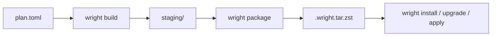

# Architecture

Wright is a single CLI binary backed by one core library.

## Roles

| CLI surface | Role |
|-------------|------|
| `wright build`, `wright package`, `wright resolve`, `wright prune` | build plan outputs and maintain archives in `parts_dir` |
| `wright install`, `wright upgrade`, `wright apply`, `wright launch`, other system subcommands | apply locally available parts to a target root (the live system or a fresh one) |

## Data Flow



`wright apply` and `wright launch` are source-first convergence operations. They
resolve requested plans, build each dependency-safe wave, package the resulting
outputs, and install each completed wave before continuing.

## Internal Layers

```text
bin -> cli -> commands -> operations -> workflow -> steps
                                      -> planning
                                      -> builder / transaction / part / database
```

- `cli` defines command-line schemas.
- `commands` maps CLI args into operation requests and acquires command locks.
- `operations` owns command use cases such as apply and launch.
- `workflow` schedules resumable content-addressed DAGs.
- `planning` resolves targets, expands dependency policy, and constructs build waves.
- `builder` executes one plan's lifecycle stages.
- `transaction` mutates a target root and installed-state database.

## Responsibilities

### Build-side commands

- `wright resolve` expands dependency and rebuild scope.
- `wright build` executes sandboxed stages and writes `staging/` and `outputs/`.
- `wright package` slices staging output and writes `.wright.tar.zst` archives to `parts_dir`.
- `wright prune` removes stale archives.

### `wright`

- resolve local part names by scanning `parts_dir` and reading `.PARTINFO`
- install and upgrade archives transactionally
- remove parts and cascade orphan cleanup
- verify and inspect the live system
- run `apply` as the high-level convergence operation:
  resolve targets, execute build waves, and install each wave before advancing
- run `launch` to fill a fresh target root from plans or groups, sharing
  the install transaction code with the live-system commands

## Shared State

The installed registry (`wright.db`) records facts about installed parts —
what they declare, not what is enforced. Runtime dependencies are advisory;
`registered`, `satisfied`, and `runnable` are independent states queried by
different commands. See [Dependency Philosophy](dependency-philosophy.md) and
[ADR-0016](../adr/0016-advisory-runtime-dependencies.md).

Detailed database schemas and their roles are documented in [Database Design](../reference/database-design.md).

| Artifact | Written by | Read by |
|----------|-----------|---------|
| `plan.toml` | user | `wright build`, `wright resolve`, `wright apply` |
| `staging/` | `wright build` | `wright package`, user inspection |
| `.wright.tar.zst` | `wright package`, `wright apply` | `wright install`, `wright upgrade`, `wright sysupgrade`, `wright apply` |
| `wright.db` | `wright` | `wright`, `wright resolve`, `wright build`, `wright apply` |

For resumable command execution, see [Build Resume Model](build-resume-model.md).
For build sandboxing, see [Isolation Model](isolation-model.md).
For module-level code organization, see [Module Layout](../dev/module-layout.md).
