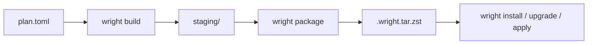

# Architecture

Wright is a single CLI binary backed by one core library.

## Roles

| CLI surface | Role |
|-------------|------|
| `wright build`, `wright package`, `wright resolve`, `wright prune`, `wright pack` | build plan outputs, maintain archives in `parts_dir`, and bundle distributable packs |
| `wright install`, `wright upgrade`, `wright apply`, `wright launch`, other system subcommands | apply locally available parts to a target root (the live system or a fresh one) |

## Data Flow

`wright apply` drives the same lower-level pieces as a source-first convergence
workflow: resolve the requested plans, build each dependency-safe wave, package
the resulting outputs, and install each completed wave before continuing.

## Responsibilities

### Build-side commands

- `wright resolve` expands dependency and rebuild scope.
- `wright build` executes sandboxed stages and writes `staging/` and `outputs/`.
- `wright package` slices staging output and writes `.wright.tar.zst` archives to `parts_dir`.
- `wright prune` removes stale archives.
- `wright pack` bundles archives and overlay content for launch.

### `wright`

- resolve local part names by scanning `parts_dir` and reading `.PARTINFO`
- install and upgrade archives transactionally
- remove parts and cascade orphan cleanup
- verify and inspect the live system
- run `apply` as the high-level orchestrator:
  resolve targets, execute build waves, and install each wave before advancing
- run `launch` to fill a fresh target root from a pack or from plans, sharing
  the install transaction code with the live-system commands

## Shared State

Detailed database schemas and their roles are documented in [Database Design](../reference/database-design.md).

| Artifact | Written by | Read by |
|----------|-----------|---------|
| `plan.toml` | user | `wright build`, `wright resolve`, `wright apply` |
| `staging/` | `wright build` | `wright package`, user inspection |
| `.wright.tar.zst` | `wright package`, `wright apply` | `wright install`, `wright upgrade`, `wright sysupgrade`, `wright apply` |
| `wright.db` | `wright` | `wright`, `wright resolve`, `wright build`, `wright apply` |
| `pack.toml` + `.wright.pack.tar` | `wright pack` | `wright launch` |

For resumable command execution, see [Build Resume Model](build-resume-model.md).
For build sandboxing, see [Isolation Model](isolation-model.md).
For module-level code organization, see [Module Layout](../dev/module-layout.md).
