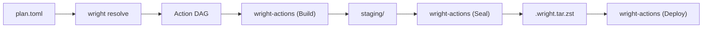

# Architecture

Wright is a single CLI binary backed by a modular Cargo workspace. The
workspace separates stable domain semantics from task scheduling and physical action
execution without exposing additional commands to users. See
[ADR-0025](../adr/0025-incremental-cargo-workspace.md) and
[ADR-0048](../adr/0048-action-graph-scheduler-and-domain-storage.md).

## Roles

| CLI surface | Role |
|-------------|------|
| `wright build` | build plan outputs and maintain archives in `parts_dir` |
| `wright merge`, `wright upgrade`, `wright install`, `wright launch`, other system subcommands | apply locally available parts to a target root (the live system or a fresh one) |

## Data Flow


```mermaid
flowchart LR
    Plan["plan.toml"] --> Resolve["wright resolve"]
    Resolve --> ActionGraph["Action DAG"]
    ActionGraph --> Build["wright-actions (Build)"]
    Build --> Staging["staging/"]
    Staging --> Seal["wright-actions (Seal)"]
    Seal --> Archive[".wright.tar.zst"]
    Archive --> Deploy["wright-actions (Deploy)"]
```

`wright install` and `wright launch` are source-first convergence operations. They
resolve requested plans into a Package DAG, lower that plan into an Action DAG with
point-to-point pipelining edges, and execute atomic actions concurrently through the
scheduler before committing state.

## Internal Layers (ADR-0048)

```text
Layer 5: CLI (wright)
Layer 4: Scheduler (wright-scheduler)
Layer 3: Planning & Actions (wright-resolve, wright-actions)
Layer 2: Infrastructure & Storage (wright-registry, wright-cache, wright-ledger,
                                  wright-lock, wright-sandbox, wright-config,
                                  wright-part, wright-plan)
Layer 1: Shared Values (wright-model)
```

- **`cli`**: Subcommand argument definitions and terminal rendering.
- **`wright-scheduler`**: Action DAG representation, compiler (`ActionPlanner`), and async concurrency executor (`ActionScheduler`).
- **`wright-resolve`**: Pure-computation Package DAG solver, cycle breaking, and dependency closure expansion.
- **`wright-actions`**: Execution handlers for the 9 canonical action atoms (Foundry sandbox builds, sealing archives, and live-system deployment transactions).
- **`wright-sandbox`**: Low-level Linux container mechanics (Mount/PID/User namespaces, OverlayFS, and resource cgroups).
- **`wright-registry`**: SQLite relational index of deployed parts, files, and dependencies (`InstalledDb`, `RegistryQuery`).
- **`wright-cache`**: Build artifact reuse cache (`BuildCache`) for zero-second compilation bypass.
- **`wright-ledger`**: Immutable append-only audit logs (`builds.jsonl`) and plan source snapshots.
- **`wright-lock`**: Advisory cross-process POSIX file locks.
- **`wright-config`**: Configuration schemas and loaders (`GlobalConfig`).
- **`wright-part`**: Archive and folio formats, compression, local stores, FHS validation, and ELF/ABI inspection.
- **`wright-plan`**: Manifest parsing, validation, discovery, and metadata expansion.
- **`wright-model`**: Dependency-free shared domain values (versions, stages, and identifiers).

## Responsibilities

### Build-side commands

- `wright resolve` expands dependency and rebuild scope.
- `wright build` executes sandboxed stages and writes `staging/` and `outputs/`.
- `wright package` validates output directories and writes `.wright.tar.zst` archives to `parts_dir`.

### `wright`

- resolve local part names by scanning `parts_dir` and reading `.PARTINFO`
- deploy and upgrade archives transactionally
- remove parts and cascade orphan cleanup
- verify and inspect the live system
- run `install` as the high-level convergence operation:
  resolve targets, compile action graph, and execute pipelined actions
- run `launch` to fill a fresh target root from plans or folios, sharing
  the deploy transaction code with the live-system commands

## Shared State

The deployed registry (`wright.db`) records facts about deployed parts —
what they declare, not what is enforced. Runtime dependencies are advisory;
`registered`, `satisfied`, and `runnable` are independent states queried by
different commands. See
[ADR-0016](../adr/0016-advisory-runtime-dependencies.md).

Detailed database schemas and their roles are documented in [Database Design](../reference/database-design.md).

| Artifact | Written by | Read by |
|----------|-----------|---------|
| `plan.toml` | user | `wright build`, `wright resolve`, `wright install` |
| `staging/` | `wright build` (Forge) | `wright package`, user inspection |
| `outputs/` | `wright build` (Mold) | `wright package` (Seal) |
| `.wright.tar.zst` | `wright package`, `wright install` (Seal) | `wright merge`, `wright upgrade`, `wright install` |
| `store/<hash>-<name>.part` | `wright install` (post-seal) | `wright install` (pre-build cache check) |
| `wright.db` | `wright` | `wright`, `wright resolve`, `wright build`, `wright install` |

For recovery from interrupted deliveries, see [Delivery Recovery](delivery-recovery.md).
For build sandboxing, see [Isolation Model](isolation-model.md).
