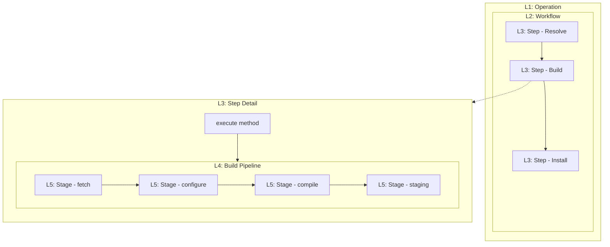
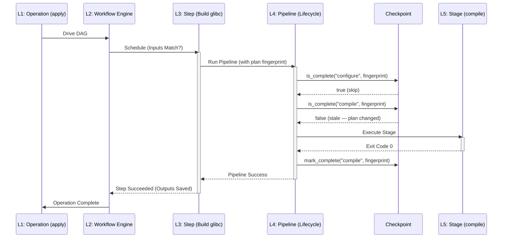

# Execution Hierarchy

This document defines the technical terminology and structural layers used in Wright's execution model. It clarifies the relationship between high-level user intent and low-level system actions.

## The Five Layers of Execution

Wright organizes execution into five distinct layers of granularity. This separation ensures that the scheduling logic (Workflow) remains decoupled from domain-specific execution logic (Pipeline).

| Layer | Term | Definition | Scope | Owner |
| :--- | :--- | :--- | :--- | :--- |
| **L1** | **Operation** | A top-level user action initiated via the CLI. | Multi-Plan / System-wide | `src/cli` |
| **L2** | **Workflow** | A Directed Acyclic Graph (DAG) of Steps required to fulfill an Operation. | Inter-Plan Dependencies | `src/workflow` |
| **L3** | **Step** | The minimum unit of **scheduling**. Has status, retries, and inputs/outputs. | Single Plan Action | `src/workflow/step.rs` |
| **L4** | **Pipeline** | The internal **logic lifecycle** of a complex Step (e.g., a Build). | Domain-specific flow | `src/builder/lifecycle.rs` |
| **L5** | **Stage** | The minimum unit of **atomic execution**. Usually a single script or command. | Sandbox / Process | `src/builder/executor` |

---

## Structural Visualization

The following diagram illustrates how these layers nest within each other.



---

## Conceptual Separation: Scheduling vs. Execution

A critical architectural boundary exists between **Step (L3)** and **Pipeline (L4)**.

### The Scheduling Layer (Workflow & Step)
The Workflow engine is "blind" to the internals of a Step. It only cares about:
- **Prerequisites:** "Can this Step run now?"
- **Resources:** "Is there a CPU or RootMutator lock available?"
- **State:** "Did it succeed, fail, or should it be retried?"
- **Identity:** The Step ID (a hash of its inputs) ensures idempotency across resumes.

### The Execution Layer (Pipeline & Stage)
The Pipeline is the domain-specific "worker" inside the Step. For a Build Step:
- **Context:** It manages a shared `/work` directory and isolation environment across its Stages.
- **Order:** It knows that `compile` must follow `configure`.
- **Granularity:** It uses **Checkpoints** to skip already completed Stages, but these checkpoints are internal to the Step and not managed by the global Workflow engine.

### Two-Level Recovery (Orthogonal Caches)

Wright maintains **two independent levels of execution progress**. They do not invalidate each other.

| Level | Storage | Granularity | Managed By | Purpose |
|-------|---------|-------------|------------|---------|
| **Workflow State** | SQLite (`workflow_steps`) | Step (L3) | `workflow/runner.rs` | "Which plans have been built/packaged/installed?" |
| **Stage Checkpoints** | `.wright-stage-*` sentinel files in `work/` | Stage (L5) | `builder/checkpoint.rs` | "Which lifecycle stages inside this plan are done?" |

**Key insight:** `--invalidate` clears Workflow State only. Stage Checkpoints remain, so a restarted `build` Step can still skip `configure` if its sentinel is valid. To force a full rebuild, use `--force` (which ignores Stage Checkpoints) or remove the `work/` directory.

### Content-Addressed Checkpoints

Stage Checkpoints are **content-addressed**. Each sentinel file stores the plan's `fingerprint` (a hash of plan metadata and sources):

```
# .wright-stage-configure
fingerprint=sha256:abc123...
```

Before skipping a Stage, the Pipeline verifies that the stored fingerprint matches the current plan. If the plan has changed, the checkpoint is automatically ignored. This prevents stale checkpoints from silently reusing outdated build artifacts.

---

## State Invalidation Matrix

| User Intent | Affected Layer | CLI Flag | Scope |
|------------|---------------|----------|-------|
| "Restart scheduling from scratch" | L2 Workflow | `--invalidate` | All Steps in this Operation |
| "Rebuild even if staging exists" | L3 Step / L4 Pipeline | `--force` | This plan's entire Pipeline |
| "Rerun from a specific stage" | L4 Pipeline | `--stage=configure` | From that stage forward |
| "Clean everything and start over" | L2 + L4 + disk | `--invalidate --force` + `rm -rf work/` | Complete reset |

---

## Execution Flow Example

When a user runs `wright apply`, the following flow occurs:



---

## Why this Distinction Matters

1.  **Performance:** Managing 800 individual Stages in a global DAG would cause significant database and scheduling overhead. Grouping them into Pipelines inside Steps keeps the DAG lean.
2.  **Context Preservation:** Stages within a Pipeline often share heavy resources (like a mounted OverlayFS). It is more efficient to run them sequentially within one Step than to teardown/setup environments between Stages.
3.  **Resilience:** Workflow handles "Process Crashes" (resuming at the Step level), while Pipeline handles "Logical Failures" (resuming at the Stage level using internal checkpoints).
4.  **Safety:** Content-addressed Checkpoints prevent the class of bugs where a plan is modified but old build artifacts are silently reused. The fingerprint mismatch guarantees a clean rebuild.

---

## Design Status & Future Improvements

The current execution hierarchy is **architecturally sound** and satisfies the core requirements of a distro build system. However, several enhancements would move it from "good" to "best-in-class":

### Already Excellent
- **Clean layer separation:** Workflow does not leak into Pipeline internals.
- **Orthogonal recovery:** Workflow State and Stage Checkpoints are independent caches with clear invalidation semantics.
- **Content-addressed checkpoints:** Eliminates an entire class of stale-build bugs.
- **Deterministic scheduling:** DAG + topological sort ensures reproducible execution order.

### Areas for Improvement

1. **Observability Gap:** There is no `wright status` or `wright log` command to inspect active workflows, pending steps, or stage checkpoints without querying SQLite directly.
2. **Single-Plan Fast Path:** A `wright build single-plan` still constructs a full Workflow DAG (3 steps: build → package → install). For single-target operations, a direct materialization path would reduce overhead.
3. **Checkpoint Distribution:** Stage Checkpoints are local filesystem files. Distributed builds (e.g. `sccache`-like remote workers) would require checkpoint persistence in shared storage.
4. **`--force` Semantic Overload:** `--force` means "rebuild from scratch" in `wright build` but "reinstall even if installed" in `wright apply`. Consider splitting into `--rebuild` and `--reinstall` for clarity.
5. **Stage-Level Force:** There is no way to force a single stage rerun (e.g. "re-run `check` but keep `compile`"). A `--force-stage=check` flag would be useful.
