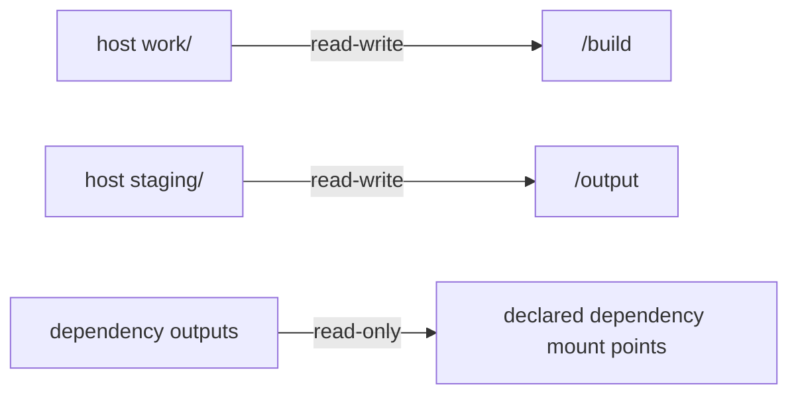

# Isolation Model

Wright build stages can run with no isolation, relaxed isolation, or strict
isolation.  Strict isolation is the default because a package build should see a
predictable build root, write only to its assigned workspace, and avoid
modifying the host system by accident.

The current strict design is multi-lowerdir OverlayFS with a per-task writable
upper layer.  It replaced the older pre-copied sysroot design recorded in
ADR-0012.  ADR-0013 is the accepted decision record for the current approach.

## Isolation Levels

| Level | Root view | Intended use |
|-------|-----------|--------------|
| `none` | host root | debugging a broken plan or running a deliberately host-integrated stage |
| `relaxed` | host root with namespaces and bind mounts | basic process and mount isolation while still seeing the live host filesystem |
| `strict` | OverlayFS root from system lowerdirs plus task-private mounts | normal builds |

Each lifecycle stage can override the default through its `isolation` field.

## Strict Root Construction

For the common case where the base root is `/`, strict isolation builds the
OverlayFS lower layer from host system directories:

```text
/usr
/bin
/sbin
/lib
/lib64
```

The paths are canonicalized, duplicate targets are removed, and subdirectories
already covered by a parent are dropped.  On a merged-/usr host, for example,
`/bin` usually resolves under `/usr`, so `/usr` alone covers that tree.

The resulting mount looks like:

```text
mount -t overlay overlay \
  -o lowerdir=/usr:/lib64:/lib,upperdir=<task>/upper,workdir=<task>/work \
  <task>/root
```

Every build task gets a distinct scratch directory:

```text
<build_dir>/.wright-isolation/<task_id>/
|-- root/
|-- upper/
`-- work/
```

The lower layers are read-only through OverlayFS.  If a build unexpectedly opens
a system path for writing, OverlayFS copies that file into the task's private
upper layer.  That write does not affect the host and does not affect another
parallel task.

## Task Mounts

After the OverlayFS root is mounted, Wright bind-mounts the task-specific
workspaces into the new root:



It also mounts or bind-mounts the runtime pieces needed for ordinary build
tools:

- `/proc`
- `/dev`
- tmpfs `/run`
- tmpfs `/tmp`
- selected read-only `/etc` files such as `ld.so.cache`, `resolv.conf`,
  `hosts`, `passwd`, `group`, and `/etc/ssl`

The process then pivots into the new root, clears the inherited environment,
sets a small default environment, changes directory to `/build`, and executes
the stage script.

## Merged-/usr Fix

OverlayFS lowerdir canonicalization can flatten a merged-/usr hierarchy.  When
the lowerdir collapses to `/usr`, paths such as `/usr/lib` can appear at `/lib`
inside the overlay root, leaving no visible `/usr` directory.

That breaks programs that consult the host `ld.so.cache`, because the cache can
contain absolute paths like `/usr/lib/libreadline.so.8`.  Wright detects a
missing `/usr` after the overlay mount and bind-mounts host `/usr` read-only at
`/usr` inside the isolation root.

## Why OverlayFS Is Used

Earlier bind-mount based designs exposed shared host or sysroot inodes directly
to every parallel task.  That made ETXTBSY failures possible when many tasks
execed the same interpreter through shebang resolution.

OverlayFS changes the failure surface:

- writes through the overlay path go to the private upper layer
- unexpected system writes do not mutate shared lower inodes
- copy-up gives the task a private inode after write contention
- `/build` and `/output` are task-private bind mounts

There is still an edge case where a host process briefly holds a write reference
to a lower-layer inode at the exact moment a build task tries to execute it.
Wright handles that with ETXTBSY retry logic at both the isolation exec layer
and the lifecycle stage layer.  Contributor details are in
[Isolation Race Handling](../dev/isolation-pitfalls.md).

## Relationship to ADRs

The current design is ADR-0013:

- [ADR-0013: Multi-lowerdir OverlayFS isolation](../adr/0013-multi-lowerdir-isolation.md)

Historical context:

- ADR-0010 used a pre-copied read-only sysroot with bind mounts.
- ADR-0012 returned to OverlayFS with a pre-copied sysroot lower layer.
- ADR-0013 removed the pre-copy and uses host system directories as lowerdirs.
