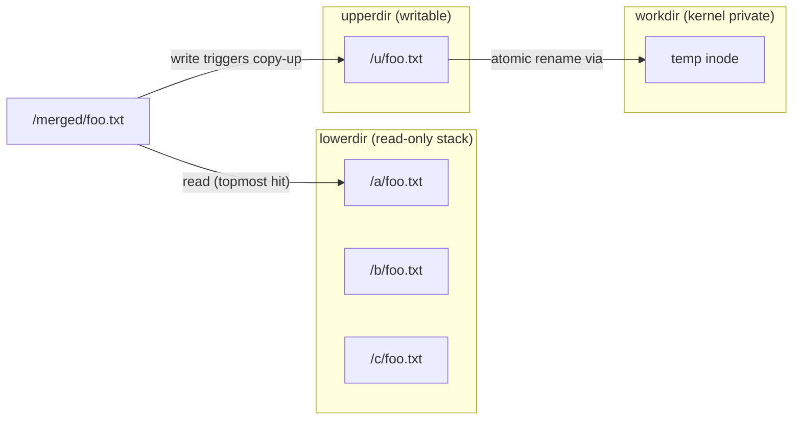
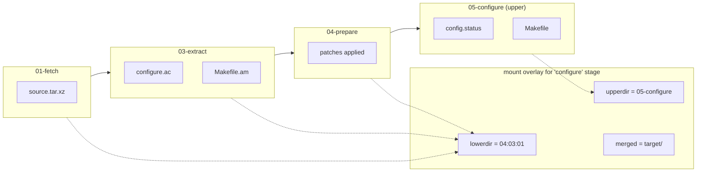
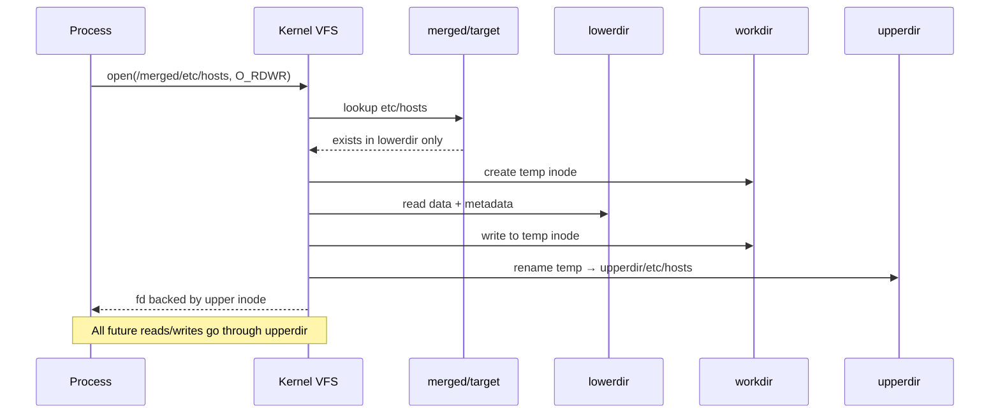
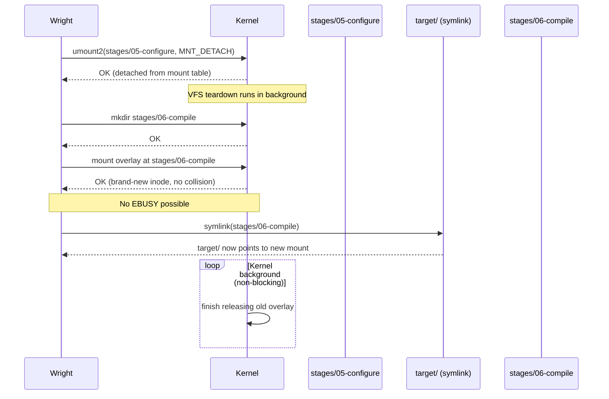
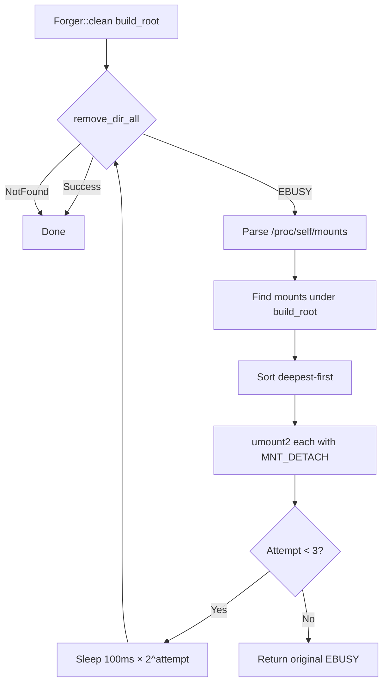
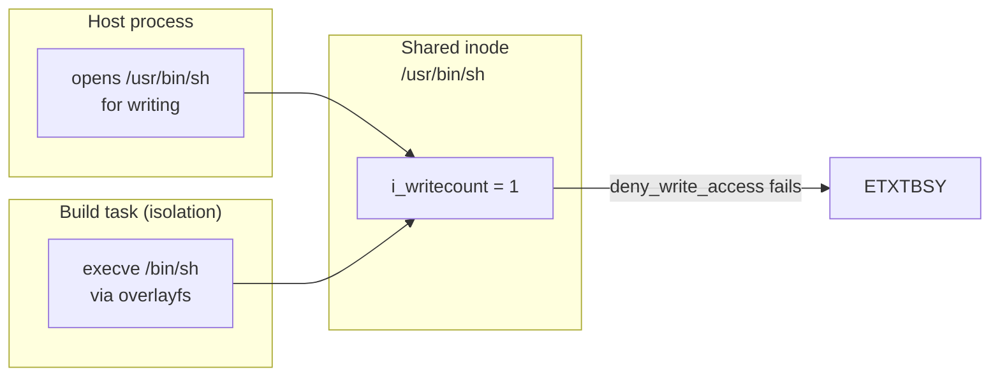
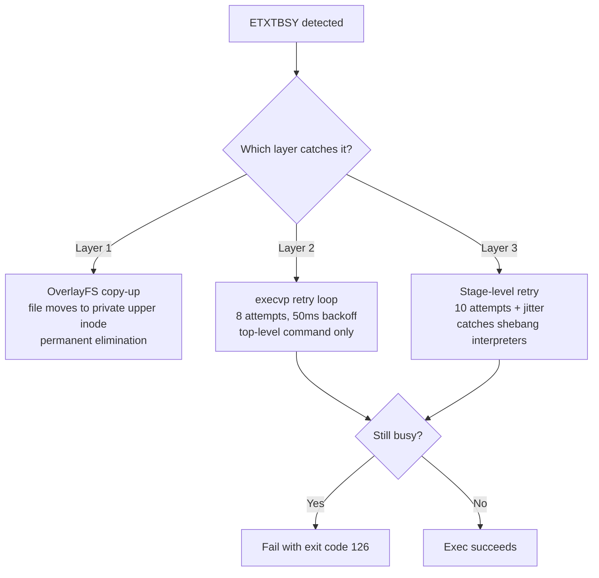
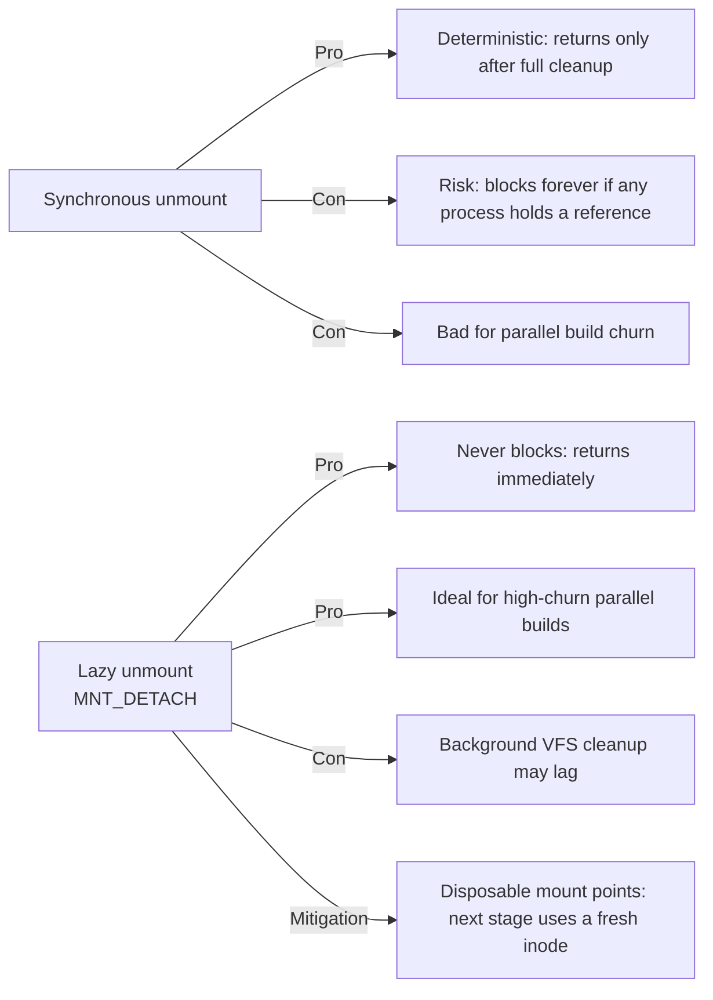

# OverlayFS Layers and Concurrent Busy Races

Wright uses OverlayFS in two separate but related places: the **host-side build
pipeline** (`LayerManager`) stacks completed build stages so that each new stage
sees the accumulated output of all previous stages; and the **strict isolation
sandbox** (`src/isolation/native.rs`) mounts a per-task writable root
filesystem on top of read-only host system directories. Both paths share the
same kernel mechanism, and both are exposed to the same class of concurrency
races that OverlayFS inherits from the VFS layer.

## OverlayFS core mechanism

OverlayFS presents a *merged* view of two or more directory trees:

- **`lowerdir`** — read-only base layer(s). Multiple lower directories are
  stacked left-to-right in the `lowerdir=` option (leftmost is the *topmost*
  layer in lookup order).
- **`upperdir`** — writable layer. Any modification to a file that lives in a
  lower layer is first *copied up* into `upperdir`; after copy-up, all
  subsequent access goes through the upper inode.
- **`workdir`** — a directory on the same filesystem as `upperdir`, used
  exclusively by the kernel for atomic copy-up and rename operations.
- **merged mount point** — the directory where the kernel assembles the unified
  view.

A mount invocation looks like this:

```text
mount -t overlay overlay \
  -o lowerdir=/a:/b:/c,upperdir=/u,workdir=/w \
  /merged
```

Lookup walks the layers from left to right in `lowerdir`. If `/a/foo.txt`
exists, it is visible in `/merged/foo.txt`. If a process opens
`/merged/foo.txt` for writing, the kernel copies the file into `/u/foo.txt`
and redirects the write there; from that point on, `/merged/foo.txt` is
served from the upper inode.



## Two usage patterns in Wright

### Host-side stage layering (`LayerManager`)

`src/forge/layers.rs` maintains an OverlayFS stack for every plan build.
Directories under `<build_root>/layers/` hold the frozen output of each stage:

```text
<build_root>/
├── layers/
│   ├── 01-fetch/
│   ├── 03-extract/
│   ├── 04-prepare/
│   ├── 05-configure/
│   └── 06-compile/   ← current writable upper
├── stages/           ← disposable mount points (one per stage)
│   ├── 01-fetch/
│   ├── 03-extract/
│   ├── 04-prepare/
│   ├── 05-configure/
│   └── 06-compile/
├── target/ -> stages/06-compile/   ← stable symlink, atomically rotated
└── .ovl_work/        ← kernel working directories
```

When a stage starts, `LayerManager::mount_overlay()` collects all previously
completed layers in reverse order (so that the most recent stage shadows
earlier ones), mounts them as `lowerdir`, and sets the current stage directory
as `upperdir`.  The critical difference from earlier designs is that the overlay
is mounted onto a **fresh disposable directory** under `stages/` rather than
reusing a single `target/` directory.  The stable `target/` entry is a symlink
that is atomically repointed to the new mount point.  The build script runs
inside `target/`, which transparently sees the union of all prior work plus any
new writes.

After the stage finishes, the overlay is lazy-unmounted (`MNT_DETACH`) and the
mount point is simply left behind; the next stage receives a brand-new
directory, so the kernel's asynchronous teardown of the old overlay can never
block the new mount.

### Why two directories?  `layers/` vs. `stages/`

They have **completely different roles** and are not redundant:

| Directory | Role in OverlayFS | Lifetime | Content |
|-----------|-------------------|----------|---------|
| `layers/<stage>/` | **`upperdir`** (writable layer) + **frozen output** | Persistent across the whole build and beyond | The files the stage actually created or modified. After the stage completes this directory *is* the stage's output layer, reused as `lowerdir` for all subsequent stages. |
| `stages/<stage>/` | **Merged mount point** (`target/`) | Disposable — one per stage invocation | A transient view of `lowerdir + upperdir` while the overlay is mounted. After `MNT_DETACH` it becomes an empty directory again. |

In other words: `layers/` stores **data** (the build artifacts), while `stages/`
stores **mount points** (kernel VFS attachment points).  Mount points are cheap
and disposable; build artifacts must be preserved so later stages can use them
as read-only lower layers.

When OverlayFS is active, `commit_layer()` is **not needed** on the hot path
because the stage's writes already land directly in `layers/<stage>/` via the
`upperdir`.  The method only runs in the non-OverlayFS fallback path, where
the target is a plain directory and the stage's delta must be harvested
manually.



### Isolation sandbox root (`src/isolation/native.rs`)

Strict isolation runs each build command inside a mount namespace. Instead of
copying a full sysroot, the sandbox mounts an OverlayFS whose lower layers are
the host system directories (`/usr`, `/bin`, `/lib`, `/lib64`) and whose
upper/work directories are per-task scratch paths under
`<build_root>/.wright-isolation/<task_id>/`.

The result is a private, writable root filesystem that is cheap to create
(no copying) and always reflects the live host system libraries and tools.
Any writes to system paths are captured in the task-private upper layer and
are discarded when the namespace is torn down. See
[ADR-0013](../adr/0013-multi-lowerdir-isolation.md) for the design record.

```mermaid
flowchart TD
    subgraph host ["Host filesystem"]
        H1[/usr]
        H2[/bin]
        H3[/lib]
        H4[/lib64]
    end

    subgraph task ["Per-task scratch"]
        UPPER[".wright-isolation/{task_id}/upper"]
        WORK[".wright-isolation/{task_id}/work"]
    end

    subgraph ns ["Isolation mount namespace"]
        subgraph overlay ["OverlayFS root"]
            O1[/usr]
            O2[/bin]
            O3[/build]
            O4[/output]
        end
    end

    H1 -.lowerdir.-> O1
    H2 -.lowerdir.-> O2
    H3 -.lowerdir.-> O1
    H4 -.lowerdir.-> O4

    UPPER -.upperdir.-> overlay
    WORK -.workdir.-> overlay

    BM1["bind-mount<br/>config.src_dir"] --> O3
    BM2["bind-mount<br/>config.output_dir"] --> O4
```

## Copy-up: the mechanism behind write isolation

Copy-up is the operation that makes a lower-layer file writable inside the
merged view. The kernel:

1. Creates a temporary file in `workdir/`.
2. Copies data and metadata from the lower inode.
3. Atomically moves the temporary file into `upperdir/` at the correct path.
4. Updates the overlay dentry cache so that subsequent lookups hit the upper
   inode.

Because copy-up requires write access to both `upperdir` and `workdir`, they
must reside on the same filesystem. This is why Wright places both under the
same build root. Copy-up also means that the first write to a large lower-layer
file incurs a full copy penalty, but in practice build scripts rarely modify
system files — they write to `/build` and `/output`, which are bind-mounted
separately and never trigger copy-up.



## Concurrent busy races

OverlayFS is not inherently racy, but the way Wright mounts and unmounts
stacks rapidly in parallel creates three distinct collision windows.

### EBUSY on mount: eliminated by disposable mount points

> **Status: resolved by architecture rewrite (v5.2+).**  The old design reused a
> single `target/` directory as the mount point for every stage, which made
> `EBUSY` unavoidable under high concurrency.  The current design mounts each
> stage onto a fresh directory under `stages/` and atomically rotates the
> `target/` symlink.  Because the kernel never sees a remount on the same inode,
> the lazy-unmount race is gone from the hot path.

**Historical symptom (pre-v5.2)**

```text
failed to mount overlay at /var/tmp/wright/workshop/hwy-1.2.0/target
after stale-state repair: EBUSY: Device or resource busy
```

**Historical root cause**

`LayerManager` unmounted the current stage overlay immediately after the stage
exited, then mounted a new overlay (with a different upper layer) for the next
stage onto the *same* `target/` directory. The unmount used
`umount2(..., MNT_DETACH)` — a *lazy* unmount that returns success as soon as
the mount point is removed from the mount table, but the kernel may still be
tearing down the old overlay's internal VFS structures for a few milliseconds.

If the next mount call arrived before that teardown completed, the kernel
returned `EBUSY`. This was especially likely when:

- The host was under high CPU or I/O pressure.
- Multiple parallel plans were cycling through stages, causing frequent
  mount/unmount churn on the same CPU.
- The previous stage's isolation child exited very recently, and the kernel
  was still finalising namespace destruction in the background.

**How the new design fixes it**



Because each stage receives a **never-before-mounted directory**, the kernel's
VFS cleanup of the *previous* overlay is completely decoupled from the *next*
mount.  There is no retry loop, no exponential backoff, and no jitter — the
race window simply does not exist.

### EBUSY on cleanup: stale mounts from crashed runs

**Symptom**

```text
failed to clean forge directory /var/tmp/wright/workshop/bison-3.8.2:
Device or resource busy (os error 16)
```

**Root cause**

When Wright crashes, is SIGKILLed, or hits an OOM, `LayerManager`'s `Drop`
never runs. The overlay mount remains active in the kernel mount table even
though no Wright process holds it. The next build attempt tries to
`remove_dir_all` the build root, walks into the still-mounted `target/`
subdirectory, and receives `EBUSY` because you cannot delete a mount point.

**Defence**

`force_clean_dir` (`src/forge/layers.rs`) wraps every forge-directory cleanup:

1. Attempt `remove_dir_all`. Return on success or `NotFound`.
2. On `EBUSY`, parse `/proc/self/mounts` to find any mount whose target is
   inside the path, sort deepest-first, and `umount2(..., MNT_DETACH)` each
   one.
3. Sleep `100 ms · 2^attempt` and retry, up to 3 attempts.

Reading `/proc/self/mounts` is necessary because the cleanup may be running in
a *different* process from the one that created the mounts (the original
process crashed). See [Isolation Race Handling](../dev/isolation-pitfalls.md)
for the full contributor-oriented write-up.



### ETXTBUSY on exec: shared inode write-count contention

**Symptom**

```text
./configure: /bin/sh: bad interpreter: Text file busy
```

Exit code 126.

**Root cause**

When a process executes a file, the kernel calls `deny_write_access()`, which
increments `i_writecount` on the inode. If another process holds a write
reference to the same inode at that exact moment, `deny_write_access()` fails
and the exec returns `ETXTBSY`.

In Wright's isolation sandbox, the lower layers are host system directories
mounted read-only through OverlayFS. OverlayFS itself never opens lower-layer
inodes for writing — writes are redirected to the per-task upper layer via
copy-up. However, a *host* process (outside the sandbox) can briefly hold a
direct write reference to a lower-layer inode. When a parallel build task
tries to `execve()` that same binary through the overlay path, the inode-level
collision produces `ETXTBSY`.

This is a *transient* race: the host write reference is usually released
within milliseconds. The problem is amplified when multiple parallel tasks all
execute the same interpreter (e.g. `/bin/sh`) through shebang resolution at
the same time.



**Defence (layered)**

Wright uses three independent layers of defence:

1. **OverlayFS with per-task upper layers** (`src/isolation/native.rs`): any
   write through the overlay path is copy-up'd into a private upper inode,
   permanently eliminating contention for that path. See
   [ADR-0013](../adr/0013-multi-lowerdir-isolation.md).

2. **Top-level execvp retry** (`src/isolation/native.rs`): the grandchild
   process retries `execvp()` up to 8 times with exponential backoff
   (`50 ms · 2^attempt`). This catches collisions on the top-level command
   itself.

3. **Stage-level retry with jitter** (`src/forge/pipeline.rs`): when a stage
   exits with code 126 and its output contains "Text file busy", the pipeline
   retries the *entire stage* up to 10 times with capped exponential backoff
   (200 ms – 1000 ms base) and **randomised jitter** on each delay.

   The jitter is critical: with N parallel tasks all hitting the same shared
   inode, a deterministic backoff causes every retrier to wake at the same
   instant and re-collide. Jitter spreads the retries across the recovery
   window so the contention drains.

   This catches the shebang case (`./configure` → kernel resolves
   `#!/bin/sh` → `/bin/sh` busy) that the lower-level `execvp` retry never
   sees, because that retry only fires for the top-level command
   (`/bin/bash`), not for nested shebang interpreters.



## Why not synchronous unmount?

A natural question is why unmount uses `MNT_DETACH` instead of waiting for a
synchronous unmount. The answer is that a synchronous unmount (`umount2`
without `MNT_DETACH`) blocks until *all* references to the mount are released
— including open file descriptors, current working directories, and dentry
caches held by other processes. On a busy host, a rogue process holding a
reference could stall the build pipeline indefinitely.

`MNT_DETACH` detaches the mount immediately from the namespace and allows the
kernel to clean up references lazily.  In the old design the cost was a short
`EBUSY` window when reusing the same mount point; the current design removes
even that cost by mounting each stage onto a fresh disposable directory.  The
trade-off still favours throughput over deterministic latency, but the
mitigation is now architectural (never remount the same inode) rather than
procedural (retry loops).



## Summary of kernel error codes

| Error | Where it appears | Trigger | Defence |
|-------|------------------|---------|---------|
| `EBUSY` | `mount()` in `LayerManager::mount_overlay()` | Lazy unmount from previous stage not fully torn down | Exponential backoff retry after `reset_target_dir()` |
| `EBUSY` | `remove_dir_all()` in `force_clean_dir()` | Stale overlay mount left by crashed prior run | Parse `/proc/self/mounts`, `MNT_DETACH` stale mounts, retry |
| `ESTALE` | `mount()` in `LayerManager::mount_overlay()` | Overlay workdir or upperdir was modified outside the overlay | Same path as `EBUSY` — treated as stale-state |
| `ETXTBSY` | `execvp()` inside isolation | Host process briefly holds write reference to lower-layer inode | Per-task upper layer + execvp retry + stage-level jittered retry |
| `EPERM` | `mount()` in `LayerManager::mount_overlay()` | Missing `CAP_SYS_ADMIN` (unprivileged user or restricted environment) | Fall back to hard-link based `populate_target()` |

## References

- `src/forge/layers.rs` — `LayerManager`, mount/unmount, cleanup, and commit
- `src/isolation/native.rs` — isolation sandbox mount namespace and overlay setup
- `src/forge/pipeline.rs` — stage execution and ETXTBSY retry logic
- [ADR-0012](../adr/0012-overlayfs-per-task-upper.md) — original per-task upper layer design (superseded)
- [ADR-0013](../adr/0013-multi-lowerdir-isolation.md) — current multi-lowerdir isolation design
- [Isolation Race Handling](../dev/isolation-pitfalls.md) — contributor-oriented deep dive on all races
