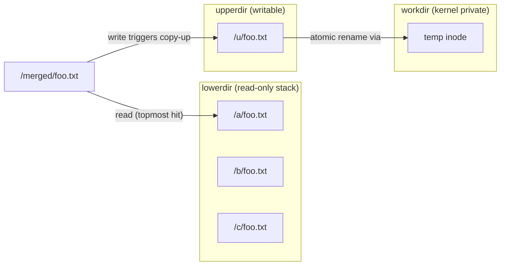
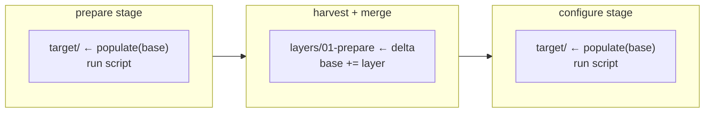

# Stage Layers, the Merged Base, and OverlayFS

Wright's build pipeline (`LayerManager`) captures each build stage's output
as a per-stage **layer** directory and maintains a cumulative **merged
base**; each stage runs against a real working tree populated from that
base.  Separately, the isolation sandbox mounts a per-task writable
**OverlayFS** root filesystem on top of read-only host system directories.
Stage working trees are deliberately *not* OverlayFS mounts — this document
explains both designs and why they differ.

## OverlayFS core mechanism

OverlayFS presents a *merged* view of two or more directory trees:

- **`lowerdir`** — read-only base layer(s). Multiple lower directories are
  stacked left-to-right in the `lowerdir=` option (leftmost is the *topmost*
  layer in lookup order).
- **`upperdir`** — writable layer. Any modification to a file that lives in a
  lower layer is first *copied up* into `upperdir`; after copy-up, all
  subsequent access goes through the upper inode.
- **`workdir`** — a directory on the same filesystem as `upperdir`, used
  exclusively by the kernel for atomic copy-up and rename operations.
- **merged mount point** — the directory where the kernel assembles the
  unified view.

A mount invocation looks like this:

```text
mount -t overlay overlay \
  -o lowerdir=/a:/b:/c,upperdir=/u,workdir=/w \
  /merged
```

Lookup walks the layers from left to right in `lowerdir`. If `/a/foo.txt`
exists, it is visible in `/merged/foo.txt`. If a process opens
`/merged/foo.txt` for writing, the kernel copies the file into `/u/foo.txt`
and redirects the write there; from that point on, `/merged/foo.txt` is
served from the upper inode.


```mermaid
flowchart LR
    subgraph lower ["lowerdir (read-only stack)"]
        direction TB
        L1["/a/foo.txt"]
        L2["/b/foo.txt"]
        L3["/c/foo.txt"]
    end

    subgraph upper ["upperdir (writable)"]
        U1["/u/foo.txt"]
    end

    subgraph work ["workdir (kernel private)"]
        W1["temp inode"]
    end

    M["/merged/foo.txt"]

    M -- "read (topmost hit)" --> L1
    M -- "write triggers copy-up" --> U1
    U1 -- "atomic rename via" --> W1
```

## Build stage layering (`LayerManager`)

The forge maintains per-stage delta directories, a cumulative merged base,
and a real working tree under the build root:

```text
<build_root>/
├── base/               ← merged base: reflink/hard-link union of source +
│                          all completed stage layers
├── layers/
│   ├── 01-prepare/     ← prepare stage's harvested delta
│   ├── 02-configure/   ← configure stage's harvested delta
│   └── 03-compile/     ← compile stage's harvested delta
├── target/             ← real directory: the stage's working tree (/build)
├── source/             ← immutable extracted source (Charge)
└── .base_manifest      ← records exactly what base/ contains
```

When a stage starts, `populate_target` populates `target/` from `base/` —
reflinks (copy-on-write clones) where the filesystem supports them (btrfs,
xfs), hard links elsewhere, full copies as a last resort.  The sandbox then
bind-mounts `target/` as `/build` (unisolated stages work in it directly),
so the build script sees an ordinary directory tree with ordinary
filesystem semantics.

When the stage finishes, `commit_layer` harvests the delta: everything in
`target/` that is absent from — or differs from — `base/` is linked into
the stage's `layers/NN-stage/` directory, and paths the stage deleted are
recorded in a tombstone manifest.  The layer is then merged into `base/`,
so the next stage's `target/` starts from the complete accumulated tree.


```mermaid
flowchart LR
    subgraph stage1 ["prepare stage"]
        P1["target/ ← populate(base)<br/>run script"]
    end
    subgraph harvest1 ["harvest + merge"]
        M1["layers/01-prepare ← delta<br/>base += layer"]
    end
    subgraph stage2 ["configure stage"]
        C1["target/ ← populate(base)<br/>run script"]
    end

    stage1 --> harvest1 --> stage2
```

#### Why `layers/` and `base/` are both needed

They have completely different roles:

| Directory | Role | Lifetime | Content |
|-----------|------|----------|---------|
| `layers/<NN>-<stage>/` | Frozen per-stage delta | Kept for checkpoint resume | Exactly the files the stage created or modified, plus a tombstone manifest for deletions |
| `base/` | Source for the next stage's `target/` | Rebuilt on resume/rewind | Reflink/hard-link union of `source/` and all completed layers |

`layers/` stores **bookkeeping** (per-stage deltas that let resume rewind
to any stage), while `base/` stores the **working view**.  Per-stage
deltas can always be re-merged, so `base/` is a derived artifact: a
recorded manifest (`.base_manifest`) tracks its contents, and any
mismatch with the checkpointed stages triggers a rebuild.

#### Why not OverlayFS for `/build`? (ADR-0037)

An earlier design ([ADR-0036](../adr/0036-merged-base-stage-overlays.md),
superseded) mounted each stage's overlay as `/build` with `lowerdir=base`.
It collapsed within a day of release: cargo creates `target/` via a
temporary-directory rename, and OverlayFS rejects directory renames in the
vicinity of lower-layer directories with `EXDEV`.  The mount option that
lifts the restriction, `redirect_dir=on`, stores its metadata in
`trusted.overlay.*` xattrs, which only the initial user namespace's
`CAP_SYS_ADMIN` may write — so user-namespace mounts (the only kind Wright
makes, even as root) reject it with `EPERM`.  There is no mount-option
combination that makes directory renames work in an unprivileged overlay,
and directory renames are stock behavior for build tooling.

A real directory tree has no such semantic gaps, and it also removes every
mount-lifecycle failure mode by construction: there is nothing to leak on
crash and nothing to race at stage transitions.

#### Reflinks vs hard links

Populating `target/` by hard links couples inodes across the working tree,
`base/`, and the layers a file came from: an in-place write
(`echo >> file`) would silently rewrite every sibling and corrupt the
layer record.  Reflinks (`FICLONE`) are therefore preferred wherever the
filesystem supports them — a copy-on-write clone keeps the modification
private to the working tree, where the harvest diff sees it as a real
change.  On filesystems without reflink support the hard-link fallback
retains the historical caveat: build scripts must replace files rather
than rewrite them in place (the common case — `sed -i`, `patch`, editors —
all replace via rename).

#### Deletions: tombstones (and legacy whiteouts)

A stage that deletes a path simply deletes it from `target/`; the harvest
records the relative path in the layer's tombstone manifest
(`.wright-layer-deletions`), and the merge applies it to `base/`.

Layer directories written by overlay-based builds (≤ 5.5.1) may instead
contain OverlayFS whiteouts (char device `0:0`, or zero-length files with a
`user.overlay.whiteout` xattr) and opaque-directory markers.  The merge
still translates those encodings so that resuming an older build root
produces the same `base/`.

## Isolation sandbox root (OverlayFS, unchanged)

Strict isolation runs each build command inside a mount namespace. Instead
of copying a full sysroot, the sandbox mounts an OverlayFS whose lower
layers are the host system directories (`/usr`, `/bin`, `/lib`, `/lib64`)
and whose upper/work directories are per-task scratch paths under
`<build_root>/.wright-isolation/<task_id>/`.  `target/` is bind-mounted as
`/build` inside the same namespace; `/output` is a bind-mount.

The result is a private, writable root filesystem that is cheap to create
(no copying) and always reflects the live host system libraries and tools.
Any writes to system paths are captured in the task-private upper layer
and are discarded when the namespace is torn down.  Build scripts
essentially never rename directories under system paths, so the OverlayFS
rename restriction does not apply here in practice — and this design
([ADR-0013](../adr/0013-multi-lowerdir-isolation.md)) predates and is
unaffected by the stage-layering change.

```mermaid
flowchart TD
    subgraph host ["Host filesystem"]
        H1[/usr]
        H2[/bin]
        H3[/lib]
        H4[/lib64]
    end

    subgraph task ["Per-task scratch"]
        UPPER[".wright-isolation/{task_id}/upper"]
        WORK[".wright-isolation/{task_id}/work"]
    end

    subgraph ns ["Isolation mount namespace"]
        subgraph overlay ["OverlayFS root"]
            O1[/usr]
            O2[/bin]
            O3[/build]
            O4[/output]
        end
    end

    H1 -.lowerdir.-> O1
    H2 -.lowerdir.-> O2
    H3 -.lowerdir.-> O1
    H4 -.lowerdir.-> O4

    UPPER -.upperdir.-> overlay
    WORK -.workdir.-> overlay

    BM1["bind-mount<br/>target/ (real dir)"] --> O3
    BM2["bind-mount<br/>config.output_dir"] --> O4
```

## Copy-up: the mechanism behind write isolation

Copy-up is the operation that makes a lower-layer file writable inside the
merged view. The kernel:

1. Creates a temporary file in `workdir/`.
2. Copies data and metadata from the lower inode.
3. Atomically moves the temporary file into `upperdir/` at the correct path.
4. Updates the overlay dentry cache so that subsequent lookups hit the upper
   inode.

Because copy-up requires write access to both `upperdir` and `workdir`, they
must reside on the same filesystem. This is why Wright places both under the
same build root. Copy-up also means that the first write to a large lower-layer
file incurs a full copy penalty, but in practice build scripts rarely modify
system files — they write to `/build` and `/output`, which are mounted
separately and never trigger copy-up of system files.

## Concurrency and the kernel's in-use protection

OverlayFS takes an **exclusive in-use lock** on every mount's `upperdir`
and `workdir`.  Mounting another overlay that names an in-use directory as
its own `upperdir`, `workdir`, *or as a `lowerdir`* fails the mount: with
`index=on` (the default when the kernel is built with
`CONFIG_OVERLAY_FS_INDEX=y`) the failure is a hard `EBUSY`; with
`index=off` it degrades to a kernel-log warning about undefined behavior.
The check exists to stop two live overlays from sharing a writable layer —
the kernel comment cites leaked container-runtime mounts as the canonical
case.

An overlay superblock does not die synchronously with `umount2`.  While
any process still references it — an orphan in the sandbox's PID
namespace, a deferred kernel `mntput` — its upperdir stays locked.  Under
heavy parallel build load this window was observed to exceed 600 ms.

This protection is now only relevant to the sandbox **root** overlay, whose
upper/work dirs are per-task scratch that nothing else references.  Stage
layering mounts nothing at all: `target/` is a plain directory, so there
is no superblock to outlive a stage and no in-use lock to collide with.
The pre-ADR-0036 topology (stage N+1's `lowerdir` inside stage N's still
-dying `upperdir`) and ADR-0036's in-sandbox stage overlays are both gone,
and with them the entire stage-transition `EBUSY` class.

## ETXTBUSY on exec: shared inode write-count contention

**Symptom**

```text
./configure: /bin/sh: bad interpreter: Text file busy
```

Exit code 126.

**Root cause**

When a process executes a file, the kernel calls `deny_write_access()`,
which increments `i_writecount` on the inode. If another process holds a
write reference to the same inode at that exact moment, `deny_write_access()`
fails and the exec returns `ETXTBSY`.

In Wright's isolation sandbox, the lower layers are host system directories
mounted read-only through OverlayFS. OverlayFS itself never opens lower-layer
inodes for writing — writes are redirected to the per-task upper layer via
copy-up. However, a *host* process (outside the sandbox) can briefly hold a
direct write reference to a lower-layer inode. When a parallel build task
tries to `execve()` that same binary through the overlay path, the inode-level
collision produces `ETXTBSY`.

This is a *transient* race: the host write reference is usually released
within milliseconds. The problem is amplified when multiple parallel tasks all
execute the same interpreter (e.g. `/bin/sh`) through shebang resolution at
the same time.

**Defence (layered)**

1. **OverlayFS with per-task upper layers**: any write through the overlay
   path is copy-up'd into a private upper inode, permanently eliminating
   contention for that path. See
   [ADR-0013](../adr/0013-multi-lowerdir-isolation.md).

2. **Top-level execvp retry**: the grandchild process retries `execvp()`
   up to 8 times with exponential backoff (`50 ms · 2^attempt`). This
   catches collisions on the top-level command itself.

3. **Stage-level retry with jitter**: when a stage exits with code 126
   and its output contains "Text file busy", the pipeline retries the
   *entire stage* up to 10 times with capped exponential backoff
   (200 ms – 1000 ms base) and **randomised jitter** on each delay.  The jitter is critical: with N parallel tasks
   all hitting the same shared-inode race, a deterministic backoff causes
   every retrier to wake at the same instant and re-collide.  This catches
   the shebang case (`./configure` → kernel resolves `#!/bin/sh` →
   `/bin/sh` busy) that the lower-level `execvp` retry never sees.

## Summary of kernel error codes

| Error | Where it appears | Trigger | Defence |
|-------|------------------|---------|---------|
| `EXDEV` | directory rename in an OverlayFS working tree | Rename near lower-layer directories requires `redirect_dir`, unavailable in user namespaces | `/build` is a real directory tree, not an overlay (ADR-0037) |
| `EBUSY` | `remove_dir_all()` in `force_clean_dir()` | Stale overlay mount left by a *pre-ADR-0036* crashed run | Parse `/proc/self/mounts`, `MNT_DETACH` stale mounts, retry |
| `ETXTBSY` | `execvp()` inside isolation | Host process briefly holds write reference to lower-layer inode | Per-task upper layer + execvp retry + stage-level jittered retry |

## References

- `crates/wright-engine/src/foundry/layers.rs` — `LayerManager`, merged
  base, populate/harvest/merge machinery, reflink sharing
- `crates/wright-engine/src/isolation/native/run.rs` — isolation sandbox
  mount namespace and overlay setup
- `crates/wright-engine/src/foundry/forge/execute.rs` — stage execution
  and retry logic
- [ADR-0012](../adr/0012-overlayfs-per-task-upper.md) — original per-task
  upper layer design (superseded)
- [ADR-0013](../adr/0013-multi-lowerdir-isolation.md) — multi-lowerdir
  isolation design (sandbox root overlay)
- [ADR-0036](../adr/0036-merged-base-stage-overlays.md) — merged-base stage
  layers with sandbox-mounted stage overlays (superseded)
- [ADR-0037](../adr/0037-real-directory-stage-trees.md) — real directory
  stage working trees
- [Isolation Race Handling](../dev/isolation-pitfalls.md) —
  contributor-oriented deep dive on all races
