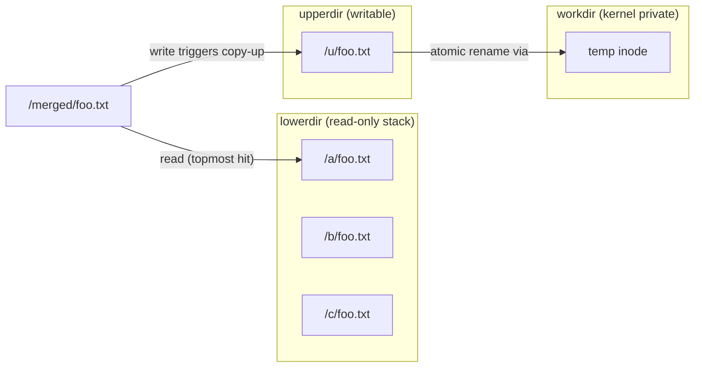
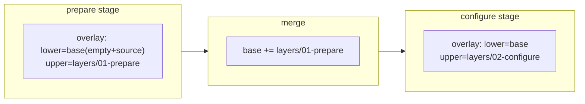

# OverlayFS Layers and the Merged Base

Wright uses OverlayFS in two separate but related places: the **build
pipeline** (`LayerManager`) captures each build stage's output as an
OverlayFS `upperdir` and merges it into a cumulative **merged base**; and
the **strict isolation sandbox** mounts a per-task writable root filesystem
on top of read-only host system directories.  Both stage overlays and the
sandbox root overlay are mounted *inside the sandbox's own mount
namespace*, so no build mount ever appears in the host mount table.

## OverlayFS core mechanism

OverlayFS presents a *merged* view of two or more directory trees:

- **`lowerdir`** — read-only base layer(s). Multiple lower directories are
  stacked left-to-right in the `lowerdir=` option (leftmost is the *topmost*
  layer in lookup order).
- **`upperdir`** — writable layer. Any modification to a file that lives in a
  lower layer is first *copied up* into `upperdir`; after copy-up, all
  subsequent access goes through the upper inode.
- **`workdir`** — a directory on the same filesystem as `upperdir`, used
  exclusively by the kernel for atomic copy-up and rename operations.
- **merged mount point** — the directory where the kernel assembles the
  unified view.

A mount invocation looks like this:

```text
mount -t overlay overlay \
  -o lowerdir=/a:/b:/c,upperdir=/u,workdir=/w \
  /merged
```

Lookup walks the layers from left to right in `lowerdir`. If `/a/foo.txt`
exists, it is visible in `/merged/foo.txt`. If a process opens
`/merged/foo.txt` for writing, the kernel copies the file into `/u/foo.txt`
and redirects the write there; from that point on, `/merged/foo.txt` is
served from the upper inode.


```mermaid
flowchart LR
    subgraph lower ["lowerdir (read-only stack)"]
        direction TB
        L1["/a/foo.txt"]
        L2["/b/foo.txt"]
        L3["/c/foo.txt"]
    end

    subgraph upper ["upperdir (writable)"]
        U1["/u/foo.txt"]
    end

    subgraph work ["workdir (kernel private)"]
        W1["temp inode"]
    end

    M["/merged/foo.txt"]

    M -- "read (topmost hit)" --> L1
    M -- "write triggers copy-up" --> U1
    U1 -- "atomic rename via" --> W1
```

## Two usage patterns in Wright

### Build stage layering (`LayerManager`)

The forge maintains per-stage delta directories and a cumulative merged
base under the build root:

```text
<build_root>/
├── base/               ← merged base: hard-link union of source + all
│                          completed stage layers; the ONLY lowerdir
├── layers/
│   ├── 01-prepare/     ← stage delta (upperdir while prepare ran)
│   ├── 02-configure/   ← stage delta (upperdir while configure ran)
│   └── 03-compile/     ← current stage's upperdir
├── target/             ← real directory: fallback-mode working tree
├── .ovl_work/          ← kernel workdirs, one per stage
├── source/             ← immutable extracted source (Charge)
└── .base_manifest      ← records exactly what base/ contains
```

When a stage starts, the sandbox mounts an overlay whose *only* lowerdir
is `base/` and whose upperdir is the stage's fresh `layers/NN-stage`
directory.  The build script runs with that overlay as `/build`, so all of
its writes land directly in the stage's own delta directory via copy-up.

When the stage finishes, the forge merges the delta into `base/` with
hard-links.  The next stage then sees the complete accumulated tree
through `base/` alone — there is no stack of overlays.


```mermaid
flowchart LR
    subgraph stage1 ["prepare stage"]
        P1["overlay: lower=base(empty+source)<br/>upper=layers/01-prepare"]
    end
    subgraph merge1 ["merge"]
        M1["base += layers/01-prepare"]
    end
    subgraph stage2 ["configure stage"]
        C1["overlay: lower=base<br/>upper=layers/02-configure"]
    end

    stage1 --> merge1 --> stage2
```

#### Why `layers/` and `base/` are both needed

They have completely different roles:

| Directory | Role | Lifetime | Content |
|-----------|------|----------|---------|
| `layers/<NN>-<stage>/` | **`upperdir`** during the stage; frozen per-stage delta after | Kept for checkpoint resume | Exactly the files the stage created, modified, or deleted (as whiteouts) |
| `base/` | **single `lowerdir`** for the next stage | Rebuilt on resume/rewind | Hard-link union of `source/` and all completed layers |

`layers/` stores **bookkeeping** (per-stage deltas that let resume rewind
to any stage), while `base/` stores the **working view**.  Per-stage
deltas can always be re-merged, so `base/` is a derived artifact: a
recorded manifest (`.base_manifest`) tracks its contents, and any
mismatch with the checkpointed stages triggers a rebuild.

#### Deletions: whiteouts, opaque directories, tombstones

A stage that deletes a file from a lower layer produces a *whiteout* in
its upperdir: a char device `0:0` (privileged mounts) or a zero-length
file carrying a `user.overlay.whiteout` xattr (user-namespace mounts).
A directory replaced wholesale carries an `*.overlay.opaque=y` marker.
The merge step translates these encodings into real deletions and
replacements in `base/`.  In the unisolated fallback path — where the
stage runs against a plain populated directory tree — deletions are
recorded as a tombstone manifest inside the layer and applied to `base/`
at merge time.

### Isolation sandbox root

Strict isolation runs each build command inside a mount namespace. Instead
of copying a full sysroot, the sandbox mounts an OverlayFS whose lower
layers are the host system directories (`/usr`, `/bin`, `/lib`, `/lib64`)
and whose upper/work directories are per-task scratch paths under
`<build_root>/.wright-isolation/<task_id>/`.  The stage overlay described
above is mounted as `/build` inside the same namespace; `/output` is a
bind-mount.

The result is a private, writable root filesystem that is cheap to create
(no copying) and always reflects the live host system libraries and tools.
Any writes to system paths are captured in the task-private upper layer
and are discarded when the namespace is torn down. See
[ADR-0013](../adr/0013-multi-lowerdir-isolation.md) for the design record
and [ADR-0036](../adr/0036-merged-base-stage-overlays.md) for the stage
layering record.

```mermaid
flowchart TD
    subgraph host ["Host filesystem"]
        H1[/usr]
        H2[/bin]
        H3[/lib]
        H4[/lib64]
    end

    subgraph task ["Per-task scratch"]
        UPPER[".wright-isolation/{task_id}/upper"]
        WORK[".wright-isolation/{task_id}/work"]
    end

    subgraph ns ["Isolation mount namespace"]
        subgraph overlay ["OverlayFS root"]
            O1[/usr]
            O2[/bin]
            O3[/build]
            O4[/output]
        end
    end

    H1 -.lowerdir.-> O1
    H2 -.lowerdir.-> O2
    H3 -.lowerdir.-> O1
    H4 -.lowerdir.-> O4

    UPPER -.upperdir.-> overlay
    WORK -.workdir.-> overlay

    BM1["stage overlay<br/>lower=base, upper=layers/NN"] --> O3
    BM2["bind-mount<br/>config.output_dir"] --> O4
```

## Copy-up: the mechanism behind write isolation

Copy-up is the operation that makes a lower-layer file writable inside the
merged view. The kernel:

1. Creates a temporary file in `workdir/`.
2. Copies data and metadata from the lower inode.
3. Atomically moves the temporary file into `upperdir/` at the correct path.
4. Updates the overlay dentry cache so that subsequent lookups hit the upper
   inode.

Because copy-up requires write access to both `upperdir` and `workdir`, they
must reside on the same filesystem. This is why Wright places both under the
same build root. Copy-up also means that the first write to a large lower-layer
file incurs a full copy penalty, but in practice build scripts rarely modify
system files — they write to `/build` and `/output`, which are mounted
separately and never trigger copy-up of system files.

## Concurrency and the kernel's in-use protection

OverlayFS takes an **exclusive in-use lock** on every mount's `upperdir`
and `workdir`.  Mounting another overlay that names an in-use directory as
its own `upperdir`, `workdir`, *or as a `lowerdir`* fails the mount: with
`index=on` (the default when the kernel is built with
`CONFIG_OVERLAY_FS_INDEX=y`) the failure is a hard `EBUSY`; with
`index=off` it degrades to a kernel-log warning about undefined behavior.
The check exists to stop two live overlays from sharing a writable layer —
the kernel comment cites leaked container-runtime mounts as the canonical
case.

An overlay superblock does not die synchronously with `umount2`.  While
any process still references it — an orphan in the sandbox's PID
namespace, a deferred kernel `mntput` — its upperdir stays locked.  Under
heavy parallel build load this window was observed to exceed 600 ms.

### The old topology, and why it raced

Before [ADR-0036](../adr/0036-merged-base-stage-overlays.md), stage N+1's
overlay listed stage N's `layers/NN` directory — the previous stage's
`upperdir`, still locked while stage N's overlay was dying — inside its
`lowerdir` stack.  The mount collided with the in-use protection whenever
teardown lagged, producing fatal `EBUSY` at stage transitions.  Retry
loops with a few hundred milliseconds of budget lost the race under load,
and crash-leftover mounts in the host mount table made repeat failures
likely.

### Why the merged base cannot race

The current design removes every term of the collision:

- **`lowerdir=base/`** — `base/` is never any overlay's `upperdir` or
  `workdir`, so it can never carry an in-use lock.  Slow teardown of a
  previous stage's overlay is irrelevant: dying overlays reference `base/`
  only as a lowerdir, which the kernel never locks.
- **`upperdir=layers/NN-stage`** — prepared fresh for each stage.  When a
  stage attempt is retried, the layer directory is *freshened*: renamed
  aside and hard-linked back into a brand-new directory.  The in-use lock
  binds the upperdir's root inode, so a retry mounts a fresh inode that
  the dying instance cannot hold.
- **Sandbox-owned mounts** — stage overlays live and die inside the
  sandbox's mount namespace.  A crashed build leaves no mount behind, so
  there is no stale mount for a later run to trip over.

There is deliberately no retry loop and no mount-flag workaround around
this path: the failure mode is excluded by construction rather than
absorbed.

## ETXTBUSY on exec: shared inode write-count contention

**Symptom**

```text
./configure: /bin/sh: bad interpreter: Text file busy
```

Exit code 126.

**Root cause**

When a process executes a file, the kernel calls `deny_write_access()`,
which increments `i_writecount` on the inode. If another process holds a
write reference to the same inode at that exact moment, `deny_write_access()`
fails and the exec returns `ETXTBSY`.

In Wright's isolation sandbox, the lower layers are host system directories
mounted read-only through OverlayFS. OverlayFS itself never opens lower-layer
inodes for writing — writes are redirected to the per-task upper layer via
copy-up. However, a *host* process (outside the sandbox) can briefly hold a
direct write reference to a lower-layer inode. When a parallel build task
tries to `execve()` that same binary through the overlay path, the inode-level
collision produces `ETXTBSY`.

This is a *transient* race: the host write reference is usually released
within milliseconds. The problem is amplified when multiple parallel tasks all
execute the same interpreter (e.g. `/bin/sh`) through shebang resolution at
the same time.

**Defence (layered)**

1. **OverlayFS with per-task upper layers**: any write through the overlay
   path is copy-up'd into a private upper inode, permanently eliminating
   contention for that path. See
   [ADR-0013](../adr/0013-multi-lowerdir-isolation.md).

2. **Top-level execvp retry**: the grandchild process retries `execvp()`
   up to 8 times with exponential backoff (`50 ms · 2^attempt`). This
   catches collisions on the top-level command itself.

3. **Stage-level retry with jitter**: when a stage exits with code 126
   and its output contains "Text file busy", the pipeline retries the
   *entire stage* up to 10 times with capped exponential backoff
   (200 ms – 1000 ms base) and **randomised jitter** on each delay.  The jitter is critical: with N parallel tasks
   all hitting the same shared-inode race, a deterministic backoff causes
   every retrier to wake at the same instant and re-collide.  This catches
   the shebang case (`./configure` → kernel resolves `#!/bin/sh` →
   `/bin/sh` busy) that the lower-level `execvp` retry never sees.

   Each overlay-mode retry also freshens the stage's upper/work directory
   root inodes (see above), so the retry's mount cannot collide with the
   previous attempt's still-dying overlay.

## Summary of kernel error codes

| Error | Where it appears | Trigger | Defence |
|-------|------------------|---------|---------|
| `EBUSY` | stage overlay mount (in-sandbox) | Previous attempt's overlay still holds the in-use lock on the upper/work dir root inodes | Fresh root inodes per attempt (`freshen_upper_layer`); lowerdir (`base/`) can never be locked |
| `EBUSY` | `remove_dir_all()` in `force_clean_dir()` | Stale overlay mount left by a *pre-ADR-0036* crashed run | Parse `/proc/self/mounts`, `MNT_DETACH` stale mounts, retry |
| `EACCES` | recursive cleanup of `.ovl_work/` | Kernel creates overlay workdir internals with mode 000 | `remove_tree_force` restores owner `rwx` before removal |
| `ETXTBSY` | `execvp()` inside isolation | Host process briefly holds write reference to lower-layer inode | Per-task upper layer + execvp retry + stage-level jittered retry |
| `EPERM` | overlay mount (unprivileged host without user namespaces) | Missing `CAP_SYS_ADMIN` and no userns overlay support | Fall back to hard-link based `populate_target()` |

## References

- `crates/wright-engine/src/foundry/layers.rs` — `LayerManager`, merged
  base, merge/freshen/cleanup machinery
- `crates/wright-engine/src/isolation/native/run.rs` — isolation sandbox
  mount namespace and overlay setup
- `crates/wright-engine/src/foundry/forge/execute.rs` — stage execution
  and retry logic
- [ADR-0012](../adr/0012-overlayfs-per-task-upper.md) — original per-task
  upper layer design (superseded)
- [ADR-0013](../adr/0013-multi-lowerdir-isolation.md) — multi-lowerdir
  isolation design (sandbox root overlay)
- [ADR-0036](../adr/0036-merged-base-stage-overlays.md) — merged-base
  stage layers with sandbox-mounted stage overlays
- [Isolation Race Handling](../dev/isolation-pitfalls.md) —
  contributor-oriented deep dive on all races
