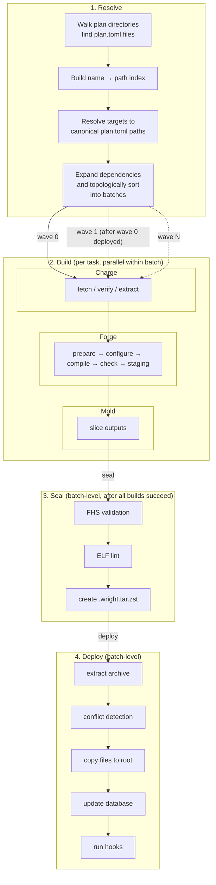

# Plan Build

This document follows a single **Delivery** — the complete journey of a plan
through resolve, build, seal, and deploy.

## Complete Flow

When a user runs `wright install zlib`, the plan goes through the following
stages. Each batch waits for the previous batch to finish resolving, building,
sealing, and deploying before it begins. This wave-by-wave approach ensures
that when `zlib`'s `configure` stage looks for OpenSSL headers, they are
already present in the system root.

## Recovery at Every Stage

The plan can be interrupted at any point, and the next identical command will continue from where it stopped:

- **Before resolve**: If the archive already exists in `parts_dir/`, the resolve step still determines whether to reuse it or rebuild.
- **Before build**: If the archive already exists in `parts_dir/`, the build is skipped.
- **During build**: `work/` reuse and stage checkpoints skip already-completed work.
- **Before deploy**: If the part is already deployed and up to date, it is skipped.
- **During deploy**: Database transactions ensure that a failed deploy leaves the system in its previous state.

This means a plan is never "half-deployed" in the database without its files, and never "half-built" on disk without its checkpoints. The boundaries are explicit and recoverable.

---

## 1. Resolve

Resolution is the first step of a delivery. It encompasses plan discovery, target resolution, dependency expansion, and execution plan construction. Once complete, Wright knows exactly which plans to build and in what order.

### Plan Discovery

A plan begins as a `plan.toml` file somewhere in the plan search path (by default under `/var/lib/wright/plans`). When a command such as `wright install`, `wright build`, or `wright package` runs, the first step is discovery.

`PlanIndex::discover` (`src/plan/discovery.rs`) walks every directory in the search path and collects every `plan.toml` it finds. It does **not** fully parse these files at this stage. Instead, it performs a lightweight extraction of only the `name` field from each TOML file to build a `name → path` map. Full parsing is deferred until the plan is actually needed.

This lazy indexing is important for performance: a tree with hundreds of plans pays the parsing cost only for the plans that participate in the current command.

### Target Resolution

The user provides targets — plan names, directory paths, or folio references such as `@core`. `resolve_targets` (`src/planning/resolver.rs`) consults the `PlanIndex` to convert these strings into canonical `plan.toml` paths.

- A bare name like `zlib` is looked up in the index.
- A path like `./plans/zlib` is resolved directly.
- A folio reference like `@core` is expanded later by `folio::expand_folio_references`.

If a target cannot be resolved, the command fails before any work begins.

### Dependency Expansion

Once the explicit targets are known, the system asks: "what else needs to be built?" This is the job of `resolve_build_set` (`src/planning/mod.rs`).

The function:

1. Starts with the explicitly requested plans.
2. Optionally expands missing dependencies (controlled by `--deps` and `--match` flags).
3. Optionally expands reverse dependents (controlled by `--rdeps`).
4. Filters out plans that do not match the selected policies (e.g. `--match=outdated` skips already-deployed plans).

The result is a flat list of plan names that constitute the **build set** — every plan that must be processed for this command to succeed.

### Execution Plan Construction

The build set is not executed in arbitrary order. `create_execution_plan` (`src/planning/mod.rs`) constructs a dependency graph and topologically sorts it into **batches**.

`build_dep_map` (`src/planning/graph.rs`) reads each plan's `build_deps` and `link_deps` to build a directed graph. Cycles are detected here. If a cycle exists, the system identifies MVP (Minimum Viable Product) candidates — plans that can be built with some dependencies temporarily excluded to break the cycle. This produces bootstrap passes such as `gcc:bootstrap` followed by a full `gcc` build.

The batches are ordered so that every plan in batch *n* depends only on plans in batches *0..n-1*. This guarantees that when a plan begins its delivery, all of its dependencies have already been resolved, built, sealed, and deployed.

Because all tasks in a batch are compiled against the same system state,
the batch is also **sealed and deployed as a unit**.  Deploying individual
tasks mid-batch would mutate the live system while sibling tasks were
still compiling, causing them to see an inconsistent dependency snapshot.

## 2. Build

Now the plan enters the foundry. `Foundry::build` (`src/foundry/mod.rs`) is responsible for turning the `plan.toml` description into populated `staging/` and `outputs/` directories.

The build step comprises three subsystems, executed in strict order:

### 2.1 Charge — Source Materialization

`Charge::prepare` decides whether the source tree in `source/` can be reused. It computes a **fingerprint** — a SHA256 hash of the plan's declared sources — and compares it against `.charge_prepared` in the build directory.

- If the fingerprint matches and `.charge_prepared` exists, `fetch`/`verify`/`extract` are skipped entirely.
- If the fingerprint differs, `source/` is wiped and sources are fetched from the source cache (`source_dir/`), verified against their SHA256 checksums, and extracted into `source/`.

The source cache is persistent across builds. A tarball is only downloaded again if it is missing or its checksum fails.

These three charge stages are **not** a batch-level preprocessing step. Each task in a batch runs its own `fetch` → `verify` → `extract` sequence inside the `tokio::spawn` that calls `Foundry::build`. A task that finishes extract proceeds directly into `configure`; it does **not** wait for sibling tasks to finish extracting.

### 2.2 Forge — Build Execution

With sources ready, the **Forge** runs. `Forge::run` (`src/foundry/forge.rs`) executes the plan's forge stages in order: `prepare`, `configure`, `compile`, `check`, `staging`.

`Forge::run` begins at `prepare` because `Charge::prepare` has already handled the source stages (`fetch`, `verify`, `extract`). The forge therefore proceeds through the user-defined stages only.

Before each stage, the forge computes an input hash chained from the stage's script, environment variables, and the preceding stage's hash. If `.wright-pipeline.json` records a matching hash with status `COMPLETED`, the stage is skipped. On success, the hash is committed. A change anywhere upstream cascades invalidation through all downstream stages. See [Checkpoint Recovery](checkpoint-recovery.md) for the full design.

Each stage runs inside an isolation sandbox (OverlayFS) with configurable resource limits. Pre- and post-hooks (`pre_<stage>`, `post_<stage>`) run around the main stage script.

### 2.3 Mold — Output Slicing

After the `staging` stage completes, `Foundry::build` calls `Mold::slice`. This hard-links files from `staging/` into `outputs/<name>/` directories according to the plan's `[[output]]` rules. A catch-all output with no `include` pattern keeps whatever remains. Any file not claimed by an output or a `[[discard]]` rule causes a fatal error.

**Mold is the sole owner of output division.** Seal never performs slicing; it only consumes the directories that Mold produces.

The result is a `FoundryResult` containing paths to the sliced output directories.

## 3. Seal

A populated `outputs/` directory tree is not the final product. `package_outputs` (`src/seal/execute.rs`) turns the sliced outputs into `.wright.tar.zst` archives.

For each output:

1. FHS validation checks that every file lives in an allowed path (`/usr/bin`, `/usr/lib`, `/etc`, etc.).
2. Optional ELF lint checks that dynamic dependencies declared in `runtime_deps` are satisfied.
3. `archive::create_part` packs the output directory into a compressed archive with an embedded `PARTINFO` metadata file.

The archive is written to `parts_dir/` (default `/var/lib/wright/parts`). Its filename includes the part name, version, release, and architecture: `zlib-1.3.1-1-x86_64.wright.tar.zst`.

If the archive already exists and `--force` was not passed, sealing is skipped entirely.

**Seal's responsibility is strictly packaging.** It does not slice outputs, decide which files belong where, or interpret `[[output]]` rules. Those concerns belong to **Mold**.

## 4. Deploy

The final step is moving the archive's contents onto the target system. `deploy_parts_with_explicit_targets` (`src/transaction/deploy.rs`) handles this.

### 4.1 Batch Validation

Before any files touch the filesystem, the deployer validates that all outputs belonging to the same plan share the same version and release. Mixed revisions within a single plan are rejected.

### 4.2 Extraction and Conflict Detection

The archive is extracted into a temporary directory. The deployer then:

1. Checks `replaces` — if the new part replaces a deployed part, the old part is removed.
2. Checks `conflicts` — if any conflicting part is deployed (and `--force` was not used), the deploy aborts.
3. Scans every file in the archive and checks whether any path is already owned by a different deployed part. These are recorded as **shadows** (diverted files).

### 4.3 Filesystem Transaction

A database transaction begins. Files are copied from the temporary extraction directory into the target root (`/` by default, or a chroot). If this step fails, the transaction is rolled back and any files already written are restored from backups.

### 4.4 Database Recording

After files are safely on disk, the deployer updates the `InstalledDb`:

- The plan is registered (or updated) in the `plans` table.
- The part is inserted into the `parts` table with its hash and origin (`Manual` or `Dependency`).
- Every file is recorded in the `files` table with its metadata.
- Shadowed files are recorded in the `shadowed_files` table.
- Runtime dependencies, conflicts, and replacements are recorded in their respective tables.

Only after the database transaction commits are the changes considered permanent.

### 4.5 Hooks

If the part defines deploy hooks (`pre_install`, `post_install`, `post_upgrade`), they run at the appropriate moments:

- `pre_install` runs before files are copied.
- `post_install` runs after the database transaction commits.

Hook failures are logged as warnings but do not abort the deploy.
