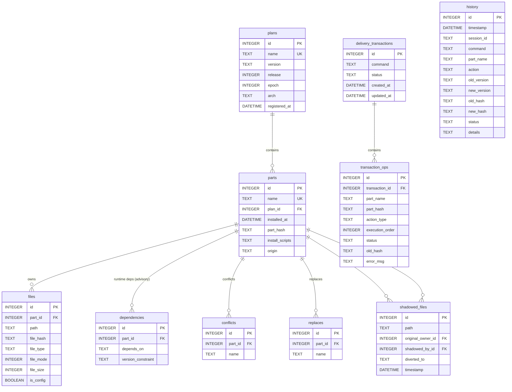

# Database Design

## Databases

| Database | Default path | Scope | Role |
|----------|--------------|-------|------|
| System DB | `/var/lib/wright/wright.db` | target root | Installed state, file ownership, dependencies, transactions |

## Archive Metadata

| Artifact | Default path | Lookup method | Role |
|----------|--------------|---------------|------|
| Part archives | `/var/lib/wright/parts/*.wright.tar.zst` | scan `parts_dir` and read `.PARTINFO` | Local archive inventory for install, upgrade, sysupgrade,  |

## Migration System

| Item | Value |
|------|-------|
| Migration files | `src/database/migrations/*.sql` |
| Migration tracker | SQLx `_sqlx_migrations` table |
| Initialization | automatic on database open |
| Upgrade | pending migrations run automatically |
| Immutable history | never edit files under `src/database/migrations/` |

## Tables

| Table | Contents |
|-------|----------|
| `plans` | plan identity metadata (name, version, release, epoch, arch) |
| `parts` | installed part metadata: origin, plan association, archive hash |
| `files` | installed file paths, types, checksums, ownership |
| `dependencies` | advisory runtime dependency edges per part (soft TEXT pointer; not enforced) |
| `conflicts` | mutually exclusive part name declarations |
| `replaces` | rename / supersession metadata |
| `shadowed_files` | file collision records used for divert and safe removal |
| `history` | permanent audit log of install, upgrade, remove actions |
| `delivery_transactions` | **Temporary WAL**: user-invoked delivery command status (cleaned after commit/rollback) |
| `transaction_ops` | **Temporary WAL**: per-DAG-node deploy actions (cleaned after commit/rollback) |

Build deps, link deps, and `provides` are deliberately not persisted. See
[Dependency Philosophy](../explanation/dependency-philosophy.md) and
[ADR-0016](../adr/0016-advisory-runtime-dependencies.md).

## Entity Relationship Diagram

## Key Constraints

| Table | Constraint | Rationale |
|-------|------------|-----------|
| `parts.name` | `UNIQUE` | Part names are globally unique identifiers |
| `parts.origin` | `CHECK(origin IN ('dependency','build','manual','external'))` | Enforces valid provenance values at the DB layer |
| `plans.name` | `UNIQUE` | Each plan name maps to exactly one plan record |
| `transaction_ops.transaction_id` | `REFERENCES delivery_transactions(id)` | Operations belong to one delivery (temporary) |

## Non-Foreign-Key References

| Field | References | Purpose |
|-------|------------|---------|
| `dependencies.depends_on` | `parts.name` (or `replaces.name`) | Advisory runtime-dependency target. Soft pointer — target may be unresolved (treated as "unsatisfied" rather than an error). |
| `history.part_name` | `parts.name` at transaction time | Historical install, upgrade, remove subject |
| `history.session_id` | `delivery_transactions.id` (legacy) | Logical grouping for history records |

## Removed Databases

| Removed artifact | Current replacement |
|------------------|---------------------|
| `archives.db` | direct `parts_dir` scan plus `.PARTINFO` reads |
| `installed.db` default name | `/var/lib/wright/wright.db` |
