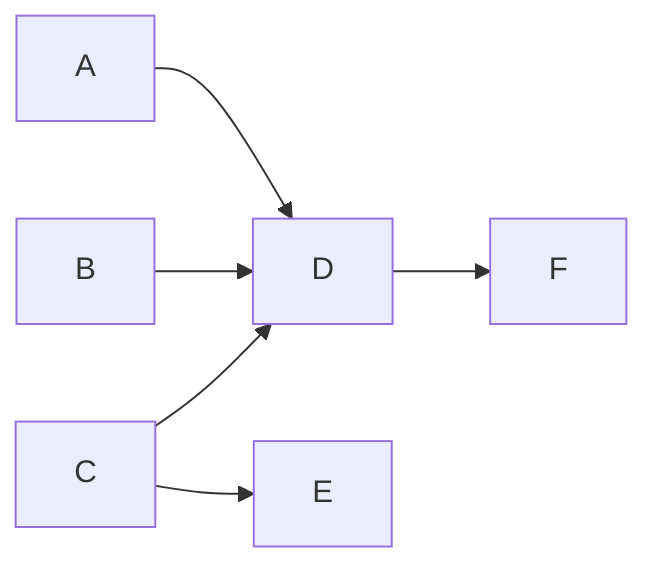

# Resource Allocation

This page explains how `wright build` allocates CPU time across builds.

## Automatic Parallelism

Wright no longer exposes a user-facing `isolations` concurrency setting. Build
task parallelism is chosen automatically from the usable CPU budget, and the
scheduler still respects dependency ordering.

On a 16-core machine with 12 usable CPUs, Wright can run up to 12 independent
build tasks in parallel. If only one task is ready, only one task runs.

## CPU Budget

By default wright reserves 4 CPUs for the OS, keeping the system responsive during heavy parallel builds:

```
total_cpus = available_cpus - 4  (minimum 1)
```

Override with `max_cpus` in `wright.toml`:

```toml
[build]
max_cpus = 16  # use exactly 16 cores; 0 or unset = available - 4
```

## Build Task Concurrency

The scheduler launches a build task only when **all of its dependencies in the
current build set have finished**. Dependency ordering is enforced
automatically. The concurrency limit is internal and derived from the usable
CPU budget, not from a user-configured `isolations` value.



| Step | Ready work |
|------|------------|
| 1 | `A`, `B`, and `C` may start together if CPU budget allows |
| 2 | `D` waits for `A` and `B` |
| 3 | `E` waits for `C` |
| 4 | `F` waits for `D` |

Even on a machine with many CPUs, Wright cannot exceed the number of currently
independent tasks in the graph.

## Forge Stage Concurrency

Wright uses three independent `tokio::sync::Semaphore` pools to gate
concurrency on the three resources that need it. The pools are
process-wide and shared across every active build task.

| Pool | Size | Each stage acquires | Effect |
|------|------|---------------------|--------|
| `configure_lock` | `1` permit | `acquire()` (1 permit) | One `configure` stage runs at a time across the whole batch. Autotools-style configure scripts are not thread-safe in shared work directories. |
| `compile_lock` | `total_cpus` permits | `acquire_many(compile_cpu_count)` | Each compile takes one permit per CPU it intends to use. The total in-flight permit count stays ≤ `total_cpus`. |
| `network_pool` | `network.max_concurrent_downloads` (default 8) | `acquire()` per source download | Caps concurrent HTTP/git fetches across the whole process. |

Other forge stages (`prepare`, `check`, `staging`) take no lock — they
run in parallel subject only to dependency ordering and the scheduler's
batch concurrency limit.

### Why compile is a counted pool, not a mutex

A binary mutex would limit the entire build to **one compile in flight**, even
on a 32-core machine where many small single-core compiles could overlap
safely. The counted pool gives correct utilization: an 8-core compile takes
8 permits, a single-threaded compile takes 1 — and two single-threaded
compiles can overlap with one 14-core compile on a 16-core box.

### Per-source parallel fetch

Within a single plan's `fetch` stage, every source (HTTP archives, git repos,
local files) runs as an independent future joined via
`futures_util::future::try_join_all`. Each future acquires one permit from
`network_pool` before opening a connection.

This means a plan with 5 sources fetches all 5 concurrently (up to 5 permits
of the global 8), not serially. Configure with `network.max_concurrent_downloads`
in `wright.toml`:

```toml
[network]
max_concurrent_downloads = 8   # default; raise for fast pipes, lower for fragile mirrors
```

See [ADR-0021](../adr/0021-cargo-style-span-driven-output.md) for the design
rationale.

## CPU Affinity Isolation

Wright pins each build task process to its computed CPU share using
`sched_setaffinity`. Tools like `nproc` inside the stage return the correct
count without any environment variable injection — the kernel enforces it.

The CPU share for each active build task is computed as:

```
cpu_share = total_cpus / active_tasks
```

`active_tasks` is the number of parts actually building at the moment a stage
launches. When the graph fans out, each part gets a smaller share; when it
collapses to a single runnable part, that part gets the full CPU budget.

The `compile_lock` semaphore then enforces that the *sum* of `cpu_share`
values across in-flight compiles never exceeds `total_cpus`.

**CPU shares are locked when a stage starts.** A stage already running is not re-pinned if another isolation finishes mid-flight.

### Static override

If you want a fixed per-task CPU count instead of the dynamic share, set
`nproc_per_isolation` in `wright.toml`:

```toml
[build]
nproc_per_isolation = 4  # each build task always gets exactly 4 CPUs
```

### Per-plan control

Scripts own their parallelism entirely. Since `nproc` returns the correct CPU count (enforced by affinity), scripts should use it directly:

```bash
make -j$(nproc)
ninja -j$(nproc)
```

For builds that need a different strategy — serial, half the cores, a fixed number — use `[options.env]` to set `MAKEFLAGS` (or whatever the tool reads) explicitly:

```toml
# Serial build
[options]
env = { MAKEFLAGS = "-j1" }

# Fixed thread count
[options]
env = { MAKEFLAGS = "-j4" }

# Go: bound runtime and build parallelism
[options]
env = { GOFLAGS = "-p=$(nproc)", GOMAXPROCS = "$(nproc)" }
```

## Example: 16-core machine (12 usable, OS reserve = 4)

| `max_cpus` | `nproc_per_isolation` | Active build tasks | CPUs per task |
|------------|----------------------|--------------------|---------------|
| unset      | unset                | 1                  | 12            |
| unset      | unset                | 4                  | 3             |
| unset      | unset                | 6                  | 2             |
| 16         | unset                | 4                  | 4             |
| unset      | 2                    | any                | 2 (fixed)     |

## Memory and Time Limits

Wright can enforce hard resource limits per build stage via the kernel's `rlimit` interface. Off by default.

| Setting | Where | Effect |
|---------|-------|--------|
| `memory_limit` (MB) | `wright.toml [build]` or `plan.toml [options]` | Caps virtual address space (`RLIMIT_AS`). Set generously (2–3× expected peak) — rustc and Go reserve large virtual mappings they never fully commit. |
| `cpu_time_limit` (seconds) | same | Caps aggregate CPU time for the stage process tree (`RLIMIT_CPU`). Kills runaway compiler loops. |
| `timeout` (seconds) | same | Wall-clock deadline per stage. Kills the process group when elapsed, regardless of CPU usage. |

Per-plan values take precedence over global config:

```toml
# wright.toml — global safety nets
[build]
timeout = 7200    # 2-hour wall-clock limit per stage
cpu_time_limit = 3600 # 1-hour CPU-time limit

# plan.toml — tighter limits for a known-fast part
[options]
timeout = 300
memory_limit = 2048
```
